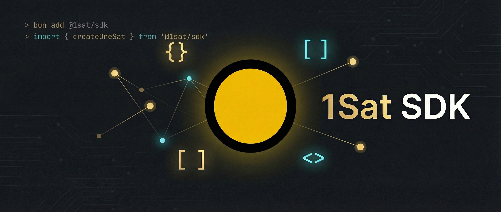

# 1Sat SDK

Build apps on [1Sat Ordinals](https://1satordinals.com) - BSV's protocol for NFTs, fungible tokens (BSV20/21), and on-chain data.

## Installation

```bash
bun add @1sat/sdk
```

For React apps with hooks and components:

```bash
bun add @1sat/react
```

## Features

- **Connect** - Wallet connection via popup (1sat.market) or future browser extensions
- **Ordinals** - Inscribe, send, and list NFTs
- **Tokens** - Full support for BSV20 (tick) and BSV21 (token ID) standards
- **Marketplace** - Create, purchase, and cancel listings
- **Signing** - Message signing (BSM) and Sigma protocol for data attestation
- **Builder** - Low-level transaction builder for custom flows
- **Actions** - Self-describing wallet operations for agents and tooling

## Quick Start

### Browser dApp

```typescript
import { createOneSat } from '@1sat/sdk'
import { Utils } from '@bsv/sdk'

const { toArray, toBase64 } = Utils

const onesat = createOneSat({
  appName: 'My dApp',
})

// Connect - opens wallet popup for user approval
try {
  const { paymentAddress, ordinalAddress } = await onesat.connect()
  console.log('Connected:', paymentAddress)
} catch (err) {
  if (err.code === 'USER_REJECTED') {
    console.log('User closed the popup')
  }
}

// Inscribe
await onesat.inscribe({
  dataB64: toBase64(toArray('Hello, Ordinals!', 'utf8')),
  contentType: 'text/plain',
})

// Transfer ordinals
await onesat.sendOrdinals({
  outpoints: ['txid_vout'],
  destination: 'recipient-address',
})

// Transfer tokens
await onesat.transferToken({
  tokenId: 'token-origin',
  amount: '100',
  destinationAddress: 'recipient-address',
})
```

### React

```tsx
import { OneSatProvider, ConnectButton, useOneSat, useBalance } from '@1sat/react'

function App() {
  return (
    <OneSatProvider appName="My dApp">
      <ConnectButton />
      <WalletInfo />
    </OneSatProvider>
  )
}

function WalletInfo() {
  const { isConnected, paymentAddress } = useOneSat()
  const { data: balance } = useBalance()

  if (!isConnected) return null

  return (
    <div>
      <p>Address: {paymentAddress}</p>
      <p>Balance: {balance?.satoshis} sats</p>
    </div>
  )
}
```

### Server-Side / Scripts

For backends or scripts where you control the keys directly:

```typescript
import { createOrdinals, fetchPayUtxos, oneSatBroadcaster } from '@1sat/sdk'
import { PrivateKey, Utils } from '@bsv/sdk'

const { toArray, toBase64 } = Utils

// SERVER SIDE ONLY - Never expose keys in client code
const privateKey = PrivateKey.fromWif(process.env.WALLET_WIF!)
const address = privateKey.toAddress().toString()

// Fetch UTXOs from indexer
const utxos = await fetchPayUtxos(address)

// Create an inscription
const result = await createOrdinals({
  utxos,
  destinations: [{
    address,
    inscription: {
      dataB64: toBase64(toArray('Hello, Ordinals!', 'utf8')),
      contentType: 'text/plain',
    },
  }],
  paymentPk: privateKey,
  changeAddress: address,
})

// Broadcast to network
const broadcastResult = await oneSatBroadcaster.broadcast(result.tx)
console.log('Inscribed:', result.tx.id('hex'))
```

### Wallet Engine

Browser (IndexedDB):

```typescript
import { OneSatWallet, StorageIdb, WalletStorageManager } from '@1sat/sdk/wallet/browser'

const storage = await WalletStorageManager.createWithProviders(
  new StorageIdb({ name: 'wallet' }),
)

const wallet = new OneSatWallet({
  rootKey: privateKey,
  storage,
  chain: 'main',
})
```

Node/Bun (SQLite):

```typescript
import { OneSatWallet, StorageSqlite, WalletStorageManager } from '@1sat/sdk/wallet/node'

const storage = await WalletStorageManager.createWithProviders(
  new StorageSqlite({ filename: 'wallet.sqlite' }),
)

const wallet = new OneSatWallet({
  rootKey: privateKey,
  storage,
  chain: 'main',
})
```

## Network Configuration

```typescript
import { API_HOST, API_HOST_TESTNET, ORDFS_HOST } from '@1sat/sdk'

// Mainnet (default)
const onesat = createOneSat({ appName: 'My dApp' })

// API endpoints:
// API_HOST: https://ordinals.gorillapool.io/api (mainnet)
// API_HOST_TESTNET: https://testnet.ordinals.gorillapool.io/api (testnet)
// ORDFS_HOST: https://ordfs.network (inscription content)
```

## Wallet Compatibility

The SDK connects to wallets via a popup interface. Currently supported:

- **1sat.market** - Default popup wallet (no extension required)

Future support planned for browser extensions and embedded wallets.

## API Reference

### createOneSat(config?)

```typescript
const onesat = createOneSat({
  appName: 'My dApp',              // Required: Your app name
  popupUrl: 'https://1sat.market', // Optional: Wallet popup URL (default: 1sat.market)
  timeout: 300000,                 // Optional: Request timeout in ms (default: 5 min)
})
```

### Provider Methods

| Method | Description |
|--------|-------------|
| `connect()` | Connect to wallet, returns `{ paymentAddress, ordinalAddress }` |
| `disconnect()` | Disconnect current session |
| `isConnected()` | Check if wallet is connected |
| `signTransaction(request)` | Sign a raw transaction |
| `signMessage(message)` | Sign a message (BSM) |
| `inscribe(request)` | Create an inscription |
| `sendOrdinals(request)` | Transfer ordinals |
| `transferToken(request)` | Transfer BSV20/21 tokens |
| `createListing(request)` | List ordinal for sale |
| `purchaseListing(request)` | Buy a listed ordinal |
| `cancelListing(request)` | Cancel a listing |
| `getBalance()` | Get wallet balance |
| `getOrdinals(options?)` | List owned ordinals |
| `getTokens(options?)` | List owned tokens |
| `getUtxos()` | Get payment UTXOs |

### Events

```typescript
onesat.on('connect', ({ paymentAddress, ordinalAddress }) => {
  console.log('Connected:', paymentAddress)
})

onesat.on('disconnect', () => {
  console.log('Disconnected')
})

onesat.on('accountChange', ({ paymentAddress, ordinalAddress }) => {
  console.log('Account changed:', paymentAddress)
})
```

### Error Handling

```typescript
import { UserRejectedError, TimeoutError, InsufficientFundsError } from '@1sat/sdk'

try {
  await onesat.connect()
} catch (err) {
  if (err instanceof UserRejectedError) {
    console.log('User rejected the request')
  } else if (err instanceof TimeoutError) {
    console.log('Request timed out')
  } else if (err instanceof InsufficientFundsError) {
    console.log('Not enough funds')
  }
}
```

## Token Operations

For token transfers via wallet popup (browser dApps):

```typescript
// Transfer tokens via wallet popup
await onesat.transferToken({
  tokenId: 'token-origin-txid_0',
  amount: '100',
  destinationAddress: 'recipient-address',
})
```

For server-side token transfers with direct key access:

```typescript
import {
  fetchPayUtxos,
  fetchTokenUtxos,
  selectTokenUtxos,
  transferOrdTokens,
  oneSatBroadcaster,
  TokenType,
} from '@1sat/sdk'
import { PrivateKey } from '@bsv/sdk'

const paymentPk = PrivateKey.fromWif(process.env.PAYMENT_WIF!)
const ordPk = PrivateKey.fromWif(process.env.ORD_WIF!)
const address = paymentPk.toAddress().toString()
const tokenId = 'token-origin-txid_0'
const decimals = 8

// Fetch UTXOs
const utxos = await fetchPayUtxos(address)
const tokenUtxos = await fetchTokenUtxos(TokenType.BSV21, tokenId, address)

// Select enough tokens for transfer
const { selectedUtxos, isEnough } = selectTokenUtxos(tokenUtxos, 100, decimals)
if (!isEnough) throw new Error('Insufficient token balance')

// Build transfer transaction
const result = await transferOrdTokens({
  protocol: TokenType.BSV21,
  tokenID: tokenId,
  decimals,
  utxos,
  inputTokens: selectedUtxos,
  distributions: [{ address: 'recipient-address', tokens: 100 }],
  paymentPk,
  ordPk,
  changeAddress: address,
  tokenChangeAddress: address,
})

// Broadcast
await oneSatBroadcaster.broadcast(result.tx)
console.log('Transferred:', result.tx.id('hex'))
```

## Protocols

| Protocol | Description |
|----------|-------------|
| **1Sat Ordinals** | NFT inscriptions on BSV |
| **BSV20** | Fungible tokens (tick-based, like BRC-20) |
| **BSV21** | Fungible tokens (origin-based, contract-like) |
| **MAP** | Magic Attribute Protocol - on-chain metadata |
| **Sigma** | Transaction data signing and attestation |
| **OrdLock** | Trustless marketplace listing contract |

## Architecture

```
┌─────────────────────────────────────────────────────────────┐
│                      Your Application                        │
├─────────────────────────────────────────────────────────────┤
│  @1sat/sdk          │  @1sat/react       │  @1sat/wallet    │
│  - createOneSat()   │  - OneSatProvider  │  - OneSatWallet  │
│  - createOrdinals() │  - useOneSat       │  - Indexers      │
│  - TxBuilder        │  - ConnectButton   │  - Sync engine   │
├─────────────────────┴──────────────────────────────────────┤
│  @1sat/connect            │  @1sat/extension                │
│  - Popup wallet connection│  - Browser extension toolkit    │
│  - postMessage protocol   │  - window.onesat injection      │
├───────────────────────────┴─────────────────────────────────┤
│  @1sat/core         │  @1sat/client      │  @1sat/protocols │
│  - TxBuilder        │  - Indexer API     │  - MAP, Sigma    │
│  - Ordinal ops      │  - Broadcast       │  - OrdP2PKH      │
│                     │  - UTXO fetch      │  - OrdLock       │
├───────────────────────────┬─────────────────────────────────┤
│  @1sat/actions      │  @1sat/utils       │  @1sat/constants │
│  - Wallet actions   │  - Encoding        │  - Protocol defs │
│  - Agent tooling    │  - Validation      │  - Endpoints     │
├─────────────────────────────────────────────────────────────┤
│  @1sat/types  │  @1sat/constants  │  @1sat/utils            │
└─────────────────────────────────────────────────────────────┘
```

### Packages

| Package | Description |
|---------|-------------|
| `@1sat/sdk` | Main SDK - browser dApps and transaction building |
| `@1sat/react` | React hooks and ConnectButton component |
| `@1sat/connect` | Popup-based wallet connection |
| `@1sat/extension` | Build browser wallet extensions with window.onesat |
| `@1sat/core` | TxBuilder and ordinal operations |
| `@1sat/client` | API client for indexer, broadcast, ORDFS |
| `@1sat/protocols` | MAP, Sigma, OrdP2PKH, OrdLock implementations |
| `@1sat/types` | TypeScript type definitions |
| `@1sat/constants` | Protocol constants and endpoints |
| `@1sat/utils` | Encoding and validation utilities |
| `@1sat/wallet` | Full BRC-100 wallet engine with indexers and sync |
| `@1sat/actions` | Self-describing wallet actions for agents and tooling |

## Development

```bash
# Install dependencies
bun install

# Build all packages
bun run --filter '*' build

# Lint
bun run lint

# Watch mode
cd packages/sdk && bun run dev
```

## Related

- [1sat.market](https://1sat.market) - Ordinals marketplace and wallet
- [js-1sat-ord](https://github.com/BitcoinSchema/js-1sat-ord) - Low-level ordinal operations
- [bitcoin-auth](https://github.com/BitcoinSchema/bitcoin-auth) - BSV authentication
- [@bsv/sdk](https://github.com/bitcoin-sv/ts-sdk) - BSV primitives

## License

MIT
