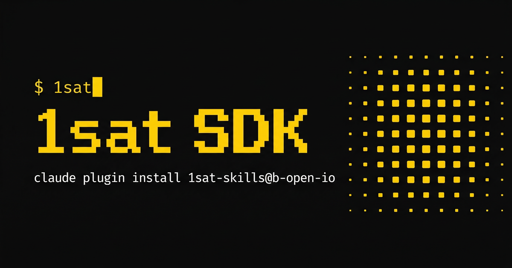

# 1Sat SDK

Build apps on [1Sat Ordinals](https://1satordinals.com) — BSV's protocol for NFTs, fungible tokens (BSV20/21), and on-chain data.

## Fastest Start

**Run the CLI immediately (no install):**

```bash
bunx @1sat/cli
```

**Add Agent Skills for Claude Code:**

```bash
claude plugin install 1sat@b-open-io
```

**Add Agent Skills for Codex:**

Install the `1sat` Codex plugin from the b-open-io marketplace to expose the
public package skills. The root `skills/` directory contains deterministic,
publishable copies generated from the colocated package skill sources; run
`python3 scripts/codex-agents/materialize_skills.py --check` to detect drift.
The internal `sdk-publish` maintainer workflow stays under `.claude/skills/`
and is not part of either public plugin. Uno Satoj is an optional custom agent
and is not installed by the plugin automatically. After an explicit request,
run the `codex-agent-setup` skill to install Uno into the current project's
`.codex/agents/` directory, then start a new Codex session and invoke
`onesat_ordinals`. Use `--user` only when you intentionally want a user-wide
install.

<details>
<summary>Individual skills (for any AI coding tool)</summary>

```bash
# CLI tool usage and commands
npx skills add b-open-io/1sat-sdk --skill 1sat-cli

# Unified BSV indexing API (api.1sat.app)
npx skills add b-open-io/1sat-sdk --skill 1sat-stack

# Wallet popup + React hooks for browser dApps
npx skills add b-open-io/1sat-sdk --skill dapp-connect

# Ordinals marketplace (list/buy/cancel OrdLock listings)
npx skills add b-open-io/1sat-sdk --skill ordinals-marketplace

# BSV21 fungible token operations
npx skills add b-open-io/1sat-sdk --skill token-operations

# Transaction building with BRC-100 actions
npx skills add b-open-io/1sat-sdk --skill transaction-building

# Wallet setup (BRC-100, storage, sync)
npx skills add b-open-io/1sat-sdk --skill wallet-setup

# Mint and inscribe ordinals/NFTs
npx skills add b-open-io/1sat-sdk --skill wallet-create-ordinals

# Time-lock BSV until block height
npx skills add b-open-io/1sat-sdk --skill timelock

# Sweep/import from external WIF
npx skills add b-open-io/1sat-sdk --skill sweep-import

# OpNS on-chain name registration
npx skills add b-open-io/1sat-sdk --skill opns-names

# Extract inscribed media from blockchain
npx skills add b-open-io/1sat-sdk --skill extract-blockchain-media
```

</details>

**Install packages for your app:**

```bash
# Browser dApps — wallet popup connection
bun add @1sat/connect

# React apps
bun add @1sat/react

# Server / scripts — direct key access
bun add @1sat/actions @1sat/client @1sat/types

# Bitcoin script templates
bun add @1sat/templates

# Full BRC-100 wallet engine
bun add @1sat/wallet-browser  # or @1sat/wallet-node
```

## What's in the Box

- **Connect** — Wallet popup connection (1sat.market) with extension auto-detection
- **Ordinals** — Inscribe, transfer, and list NFTs
- **Tokens** — Full support for BSV20 (tick) and BSV21 (origin) standards
- **Marketplace** — Create, purchase, and cancel OrdLock listings
- **Signing** — BSM message signing and Sigma protocol for data attestation
- **Builder** — Low-level transaction builder for custom flows
- **Actions** — Self-describing wallet operations for agents and tooling
- **Wallet Engine** — Full BRC-100 wallet with indexers, sync, and backup
- **CLI** — Terminal wallet with 30+ commands

## Quick Start

### Browser dApp

```typescript
import { createOneSat } from '@1sat/connect'
import { Utils } from '@bsv/sdk'

const { toArray, toBase64 } = Utils

const onesat = createOneSat({
  appName: 'My dApp',
})

// Connect — opens wallet popup if no extension is installed
try {
  const { paymentAddress, ordinalAddress } = await onesat.connect()
  console.log('Connected:', paymentAddress)
} catch (err) {
  if (err instanceof UserRejectedError) {
    console.log('User closed the popup')
  }
}

// Inscribe
await onesat.inscribe({
  dataB64: toBase64(toArray('Hello, Ordinals!', 'utf8')),
  contentType: 'text/plain',
})

// Transfer ordinals
await onesat.sendOrdinals({
  outpoints: ['txid_vout'],
  destination: 'recipient-address',
})

// Transfer tokens
await onesat.transferToken({
  tokenId: 'token-origin',
  amount: '100',
  destinationAddress: 'recipient-address',
})
```

### React

```tsx
import { OneSatProvider, ConnectButton, useOneSatContext, useBalance } from '@1sat/react'

function App() {
  return (
    <OneSatProvider appName="My dApp">
      <ConnectButton />
      <WalletInfo />
    </OneSatProvider>
  )
}

function WalletInfo() {
  const { isConnected, paymentAddress } = useOneSatContext()
  const { satoshis, isLoading } = useBalance()

  if (!isConnected) return null

  return (
    <div>
      <p>Address: {paymentAddress}</p>
      <p>Balance: {satoshis} sats</p>
    </div>
  )
}
```

### Server-Side / Scripts

For backends or scripts where you control the keys directly:

```typescript
import { createOrdinals, fetchPayUtxos } from '@1sat/actions'
import { ArcadeClient } from '@1sat/client'
import { ONESAT_MAINNET_URL } from '@1sat/types'
import { PrivateKey, Utils } from '@bsv/sdk'

const { toArray, toBase64 } = Utils

// SERVER SIDE ONLY — never expose private keys in client code
const privateKey = PrivateKey.fromWif(process.env.WALLET_WIF!)
const address = privateKey.toAddress().toString()

// Fetch UTXOs from indexer
const utxos = await fetchPayUtxos(address)

// Create an inscription
const result = await createOrdinals({
  utxos,
  destinations: [{
    address,
    inscription: {
      dataB64: toBase64(toArray('Hello, Ordinals!', 'utf8')),
      contentType: 'text/plain',
    },
  }],
  paymentPk: privateKey,
  changeAddress: address,
})

// Broadcast to network
const arcade = new ArcadeClient(ONESAT_MAINNET_URL)
const broadcastResult = await arcade.submitTransactionHex(result.tx.toHex())

if (
  broadcastResult.txStatus === 'MINED' ||
  broadcastResult.txStatus === 'SEEN_ON_NETWORK' ||
  broadcastResult.txStatus === 'ACCEPTED_BY_NETWORK' ||
  broadcastResult.txStatus === 'IMMUTABLE'
) {
  console.log('Inscribed:', result.tx.id('hex'))
}
```

### Wallet Engine

Browser (IndexedDB):

```typescript
import { createWebWallet } from '@1sat/wallet-browser'

const { wallet, services } = await createWebWallet({
  rootKey: privateKeyHex,
  chain: 'main',
})
```

Node/Bun (SQLite):

```typescript
import { createNodeWallet } from '@1sat/wallet-node'

const { wallet, services } = await createNodeWallet({
  rootKey: privateKeyHex,
  chain: 'main',
  dbFilename: 'wallet.sqlite',
})
```

### CLI

```bash
# First-time setup — generates or imports a WIF key
1sat init

# Wallet operations
1sat wallet balance
1sat wallet address
1sat wallet send --to <addr> --sats <amount>

# Ordinals
1sat ordinals list
1sat ordinals mint --file image.png
1sat ordinals sell --outpoint <txid.vout> --price 10000

# BSV21 tokens
1sat tokens balances
1sat tokens send --token-id <id> --to <addr> --amount 100

# Identity
1sat identity create
1sat identity sign --message "Hello"

# Run any registered action by name
1sat action sendBsv '{"requests":[{"address":"1A1z...","satoshis":1000}]}'
```

The CLI resolves your key from `PRIVATE_KEY_WIF` (env var, good for CI) or `~/.1sat/keys.bep` (encrypted keyfile created by `1sat init`). Pass `--json` for machine-readable output on any command.

## API Reference

### createOneSat(config?)

```typescript
const onesat = createOneSat({
  appName: 'My dApp',              // Required: your app name
  popupUrl: 'https://1sat.market', // Optional: wallet popup URL (default: 1sat.market)
  timeout: 300000,                 // Optional: request timeout in ms (default: 5 min)
})
```

`createOneSat` checks for `window.onesat` (browser extension) first. If found, it returns the injected provider. Otherwise it creates a popup-based provider.

### Provider Methods

| Method | Description |
|--------|-------------|
| `connect()` | Connect to wallet, returns `{ paymentAddress, ordinalAddress }` |
| `disconnect()` | Disconnect current session |
| `isConnected()` | Check if wallet is connected |
| `signTransaction(request)` | Sign a raw transaction |
| `signMessage(message)` | Sign a message (BSM) |
| `inscribe(request)` | Create an inscription |
| `sendOrdinals(request)` | Transfer ordinals |
| `transferToken(request)` | Transfer BSV20/21 tokens |
| `createListing(request)` | List ordinal for sale |
| `purchaseListing(request)` | Buy a listed ordinal |
| `cancelListing(request)` | Cancel a listing |
| `getBalance()` | Get wallet balance |
| `getOrdinals(options?)` | List owned ordinals |
| `getTokens(options?)` | List owned tokens |
| `getUtxos()` | Get payment UTXOs |

### Events

```typescript
onesat.on('connect', ({ paymentAddress, ordinalAddress }) => {
  console.log('Connected:', paymentAddress)
})

onesat.on('disconnect', () => {
  console.log('Disconnected')
})

onesat.on('accountChange', ({ paymentAddress, ordinalAddress }) => {
  console.log('Account changed:', paymentAddress)
})
```

### Error Handling

```typescript
import {
  UserRejectedError,
  TimeoutError,
  InsufficientFundsError,
  PopupBlockedError,
} from '@1sat/connect'

try {
  await onesat.connect()
} catch (err) {
  if (err instanceof UserRejectedError) {
    console.log('User rejected the request')
  } else if (err instanceof TimeoutError) {
    console.log('Request timed out')
  } else if (err instanceof InsufficientFundsError) {
    console.log('Not enough funds')
  } else if (err instanceof PopupBlockedError) {
    console.log('Browser blocked the popup — call connect() from a user gesture')
  }
}
```

## Token Transfers (Server-Side)

```typescript
import { fetchPayUtxos, fetchTokenUtxos, selectTokenUtxos, transferOrdTokens, TokenType } from '@1sat/actions'
import { ArcadeClient } from '@1sat/client'
import { ONESAT_MAINNET_URL } from '@1sat/types'
import { PrivateKey } from '@bsv/sdk'

const paymentPk = PrivateKey.fromWif(process.env.PAYMENT_WIF!)
const ordPk = PrivateKey.fromWif(process.env.ORD_WIF!)
const address = paymentPk.toAddress().toString()
const tokenId = 'token-origin-txid_0'
const decimals = 8

// Fetch UTXOs
const utxos = await fetchPayUtxos(address)
const tokenUtxos = await fetchTokenUtxos(TokenType.BSV21, tokenId, address)

// Select enough tokens for transfer
const { selectedUtxos, isEnough } = selectTokenUtxos(tokenUtxos, 100, decimals)
if (!isEnough) throw new Error('Insufficient token balance')

// Build and broadcast
const result = await transferOrdTokens({
  protocol: TokenType.BSV21,
  tokenID: tokenId,
  decimals,
  utxos,
  inputTokens: selectedUtxos,
  distributions: [{ address: 'recipient-address', tokens: 100 }],
  paymentPk,
  ordPk,
  changeAddress: address,
  tokenChangeAddress: address,
})

const arcade = new ArcadeClient(ONESAT_MAINNET_URL)
const broadcastResult = await arcade.submitTransactionHex(result.tx.toHex())

if (
  broadcastResult.txStatus === 'MINED' ||
  broadcastResult.txStatus === 'SEEN_ON_NETWORK' ||
  broadcastResult.txStatus === 'ACCEPTED_BY_NETWORK' ||
  broadcastResult.txStatus === 'IMMUTABLE'
) {
  console.log('Transferred:', result.tx.id('hex'))
}
```

## Architecture

```
┌──────────────────────────────────────────────────────────────┐
│                       Your Application                       │
├──────────────────────────────────────────────────────────────┤
│  @1sat/react                                                 │
│  - OneSatProvider, useOneSatContext, useBalance              │
│  - ConnectButton, useOrdinals, useInscribe                   │
├──────────────────────────────────────────────────────────────┤
│  @1sat/connect                  │  @1sat/extension           │
│  - Popup wallet connection      │  - Browser extension       │
│  - postMessage protocol         │  - window.onesat injection │
├─────────────────────────────────┴────────────────────────────┤
│  @1sat/wallet-browser   │  @1sat/wallet-node                 │
│  - createWebWallet()    │  - createNodeWallet()              │
│  - IndexedDB storage    │  - SQLite storage                  │
├─────────────────────────┴────────────────────────────────────┤
│  @1sat/wallet           │  @1sat/actions                     │
│  - OneSatWallet         │  - Action registry                 │
│  - Indexers & sync      │  - Agent tooling                   │
│  - Backup / CWI         │  - Self-describing ops             │
├─────────────────────────┴────────────────────────────────────┤
│  @1sat/templates                │  @1sat/client              │
│  - Inscription, OrdLock, Lock   │  - Indexer API             │
│  - BSV20, BSV21, AIP, BAP      │  - Broadcast (Arcade)      │
│  - MAP, Sigma, BSocial          │  - UTXO fetch, ORDFS       │
├────────────────────┬───────────────────┬─────────────────────┤
│  @1sat/cli         │  @1sat/vault      │ @1sat/wallet-desktop│
│  - Terminal wallet │  - Vault API      │ - Electrobun app    │
│  - Binary: 1sat    │  - VaultStorage   │ - BRC-100 server    │
│  - 30+ commands    │  - Secure Enclave │ - Touch ID unlock   │
├────────────────────┴───────────────────┴─────────────────────┤
│  @1sat/types            │  @1sat/utils                       │
│  - Type definitions     │  - Encoding & validation           │
│  - Protocol constants   │  - Key derivation                  │
└──────────────────────────────────────────────────────────────┘
```

## Packages

| Package | Version | Description |
|---------|---------|-------------|
| `@1sat/connect` | 0.0.9 | Popup wallet connection, postMessage protocol, session management |
| `@1sat/react` | 0.0.7 | React hooks and ConnectButton component |
| `@1sat/extension` | 0.0.4 | Build browser wallet extensions that implement `window.onesat` |
| `@1sat/client` | 0.0.16 | API clients for indexer, broadcast (Arcade), and ORDFS |
| `@1sat/templates` | 0.0.2 | Bitcoin script templates: Inscription, OrdLock, Lock, BSV20, BSV21, AIP, BAP, MAP, Sigma, BSocial |
| `@1sat/types` | 0.0.13 | TypeScript type definitions and protocol constants |
| `@1sat/utils` | 0.0.11 | Encoding, validation, and key derivation utilities |
| `@1sat/wallet` | 0.0.24 | BRC-100 wallet engine with indexers, sync, backup, and CWI |
| `@1sat/wallet-browser` | 0.0.18 | Browser wallet factory (IndexedDB storage) |
| `@1sat/wallet-node` | 0.0.13 | Node/Bun wallet factory (SQLite storage) |
| `@1sat/actions` | 0.0.54 | Self-describing wallet actions for agents and tooling |
| `@1sat/cli` | 0.0.11 | Command-line interface (`1sat` binary) with 30+ commands |
| `@1sat/wallet-remote` | 0.0.11 | Remote-only wallet factory (no local storage) |
| `@1sat/vault` | 0.0.3 | Platform-agnostic vault interface (VaultProvider, VaultStorage) |
| `@1sat/wallet-mac` | 0.0.1 | macOS Secure Enclave provider + native deposit window |
| `@1sat/wallet-desktop` | 0.0.1 | Native desktop wallet app (Electrobun + Bun + system WebView) |

## Protocols

| Protocol | Description |
|----------|-------------|
| **1Sat Ordinals** | NFT inscriptions on BSV |
| **BSV20** | Fungible tokens (tick-based, similar to BRC-20) |
| **BSV21** | Fungible tokens (origin-based, contract-like) |
| **MAP** | Magic Attribute Protocol — on-chain metadata |
| **Sigma** | Transaction data signing and attestation |
| **OrdLock** | Trustless marketplace listing contract |

## Network Constants

```typescript
import { API_HOST, API_HOST_TESTNET, ORDFS_HOST, ONESAT_MAINNET_URL } from '@1sat/types'

// API_HOST: https://ordinals.gorillapool.io/api (mainnet)
// API_HOST_TESTNET: https://testnet.ordinals.gorillapool.io/api (testnet)
// ORDFS_HOST: https://ordfs.network (inscription content)
// ONESAT_MAINNET_URL: https://api.1sat.app (Arcade broadcast endpoint)
```

## Contributing

```bash
# Install dependencies
bun install

# Build all packages
bun run build

# Lint
bun run lint

# Watch mode (all packages)
bun dev

# Build a single package
bun run --filter '@1sat/actions' build
```

Dependency order for new code: `types` → `utils` → `client` → `templates` → `actions/wallet` → `sdk` → `examples`

## Related

- [1sat.market](https://1sat.market) — Ordinals marketplace and wallet
- [js-1sat-ord](https://github.com/BitcoinSchema/js-1sat-ord) — Low-level ordinal operations
- [@bsv/sdk](https://github.com/bitcoin-sv/ts-sdk) — BSV primitives

## License

MIT
