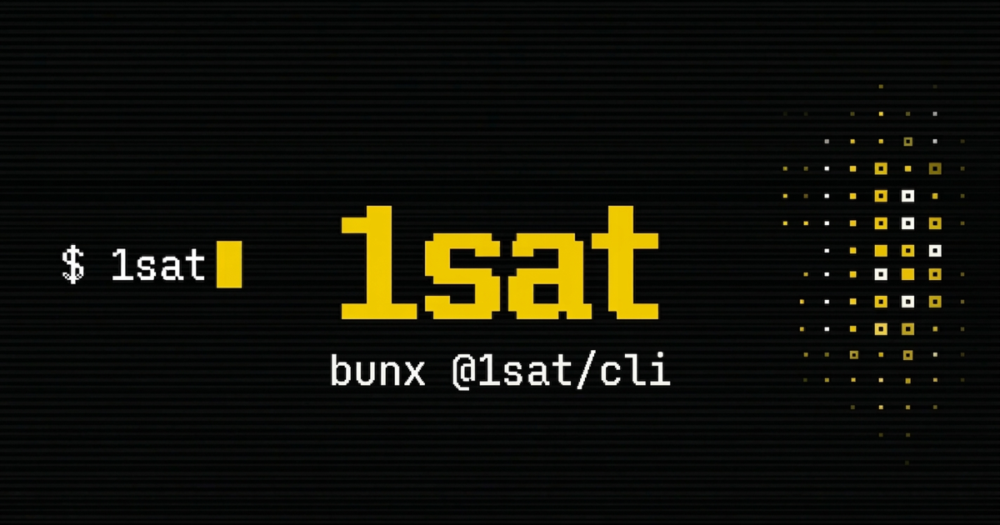

# @1sat/cli

Command-line interface for 1Sat Ordinals on BSV.

Requires the [Bun](https://bun.sh) runtime. Install Bun first:

```
curl -fsSL https://bun.sh/install | bash
```

Then:

```
bun add -g @1sat/cli
```

Or run without installing:

```
bunx @1sat/cli
```

---

## Quick Start

```bash
# 1. Set up your wallet (interactive)
1sat init

# 2. Check your balance
1sat wallet balance

# 3. List your ordinals
1sat ordinals list
```

---

## Install

**Global install (recommended):**

```bash
bun add -g @1sat/cli
```

**Run without installing:**

```bash
bunx @1sat/cli <command>
```

**Binary:** The installed binary is named `1sat`.

---

## Authentication

The CLI resolves your private key in this order:

1. `PRIVATE_KEY_WIF` environment variable — works without a password or any disk state.
2. `~/.1sat/keys.bep` — encrypted keyfile created by `1sat init`. Requires a password at runtime via `ONESAT_PASSWORD` env var or an interactive prompt.
3. Neither found — exits with an error and tells you to run `1sat init`.

**Environment variable (CI / scripting):**

```bash
export PRIVATE_KEY_WIF="<your WIF key>"
1sat wallet balance
```

**Encrypted keyfile (interactive use):**

```bash
# Set once — creates ~/.1sat/keys.bep
1sat init

# Unlock at runtime via env var
export ONESAT_PASSWORD="your-password"
1sat wallet balance

# Or enter it interactively when prompted
1sat wallet balance
```

WIF keys start with `5`, `K`, or `L` on mainnet and `c` on testnet.

---

## Configuration

All state lives in `~/.1sat/` (mode `0700`):

| File | Purpose |
|------|---------|
| `config.json` | Network, data directory, storage settings |
| `keys.bep` | AES-encrypted private key (mode `0600`) |
| `data/` | Local wallet databases |

**View current config:**

```bash
1sat config show
```

**Set a value:**

```bash
1sat config set chain test
1sat config set remoteStorageUrl https://storage.example.com
```

Settable keys: `chain`, `dataDir`, `remoteStorageUrl`, `storageIdentityKey`.

**Print config directory:**

```bash
1sat config path
```

---

## Commands

### Setup

```bash
1sat init                          # Interactive wallet setup wizard
```

`init` generates or imports a WIF key, encrypts it with a password you choose, selects mainnet or testnet, and writes `~/.1sat/config.json`.

---

### Wallet

```bash
1sat wallet balance                # Show balance in satoshis and UTXO count
1sat wallet address                # Show deposit address
1sat wallet info                   # Show address, identity key, balance, network
1sat wallet send --to <addr> --sats <amount>
1sat wallet send-all --to <addr>   # Empty the wallet to one address
```

---

### Ordinals

```bash
1sat ordinals list                              # List owned inscriptions
1sat ordinals mint --file <path>                # Inscribe a file (MIME type auto-detected)
1sat ordinals mint --file <path> --type <mime>  # Inscribe with explicit content type
1sat ordinals transfer --outpoint <txid.vout> --to <addr>
1sat ordinals sell --outpoint <txid.vout> --price <sats>
1sat ordinals cancel --outpoint <txid.vout>
1sat ordinals buy --outpoint <txid.vout>
```

Supported file types for auto-detection: `.txt`, `.html`, `.css`, `.js`, `.json`, `.svg`, `.png`, `.jpg`, `.gif`, `.webp`, `.mp3`, `.mp4`, `.pdf`, and more.

---

### Tokens (BSV21)

```bash
1sat tokens balances                                         # Show balances by token ID
1sat tokens list                                             # List all token UTXOs
1sat tokens list --token-id <id>                             # Filter by token ID
1sat tokens send --token-id <id> --to <addr> --amount <n>
1sat tokens buy --outpoint <txid.vout> --token-id <id> --amount <n>
```

`tokens deploy` is not yet available; token deployment will be added once a deploy action lands in `@1sat/actions`.

---

### Locks

```bash
1sat locks info                                 # Show locked amounts and maturity status
1sat locks lock --sats <amount> --blocks <n>    # Lock BSV until block height
1sat locks unlock                               # Unlock all matured locks
```

---

### Identity (BAP)

```bash
1sat identity create                            # Publish a BAP identity on-chain
1sat identity info                              # Show your identity key
1sat identity sign --message <text>             # Sign a message (BSM)
```

---

### Social

```bash
1sat social post --content <text>              # Create an on-chain BSocial post
1sat social post --content <text> --app <name> # Post with a custom app tag
```

---

### OpNS

OpNS (Ordinals Name System) binds your BAP identity to an on-chain name inscription.

```bash
1sat opns lookup                               # List OpNS names in your wallet
1sat opns register --outpoint <txid.vout>      # Bind your identity to a name
1sat opns deregister --outpoint <txid.vout>    # Remove the identity binding
```

---

### Sweep

Import assets from an external private key (e.g., a legacy P2PKH wallet) into your BRC-100 wallet.

```bash
1sat sweep scan --wif <key>     # Preview what a key holds (BSV, ordinals, tokens)
1sat sweep import --wif <key>   # Import everything into your wallet
```

`scan` is non-destructive. `import` broadcasts transactions — confirm when prompted or pass `--yes`.

---

### Transaction Utilities

```bash
1sat tx decode <hex>            # Decode a raw transaction hex string
```

---

### Generic Action Executor

Every action registered in `@1sat/actions` is available by name:

```bash
1sat action                     # List all registered actions grouped by category
1sat action <name>              # Run an action with no input
1sat action <name> '<json>'     # Run an action with JSON input
```

Example:

```bash
1sat action sendBsv '{"requests":[{"address":"1A1zP1eP5QGefi2DMPTfTL5SLmv7Divf","satoshis":1000}]}'
```

This executor gives scripting access to all 30+ actions without waiting for dedicated CLI subcommands to be added.

---

## Global Options

These options work with every command:

| Flag | Description |
|------|-------------|
| `--json` | Print output as JSON (machine-readable) |
| `--quiet`, `-q` | Suppress all output |
| `--yes`, `-y` | Skip confirmation prompts |
| `--chain <main\|test>` | Network selection (default: `main`) |
| `--help`, `-h` | Show help |
| `--version`, `-v` | Show version |

**JSON output example:**

```bash
1sat wallet balance --json
# {"satoshis":123456,"utxos":3}

1sat ordinals list --json
# [...array of outputs...]
```

**Scripting with --yes:**

```bash
1sat wallet send --to 1A1z... --sats 1000 --yes
```

---

## Development

Run from source inside the monorepo:

```bash
cd /path/to/1sat-sdk

# Install dependencies
bun install

# Run the CLI directly (no compile step)
bun run packages/cli/src/cli.ts <command>

# Or use the dev script from the cli package
cd packages/cli
bun dev <command>

# Build a self-contained binary
bun run build
# Output: packages/cli/bin/1sat
```

The CLI is pure Bun with no framework. Arg parsing is manual (`src/args.ts`). Bun executes TypeScript directly, so you can run from source without a compile step.

---

## License

MIT
