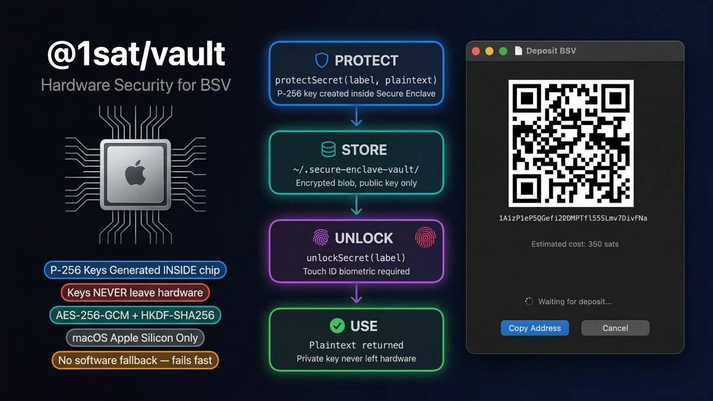

# @1sat/vault



Platform-agnostic vault interface for protecting secrets with hardware-backed encryption.

`@1sat/vault` defines the **interfaces and factory** — platform packages provide the implementation:

| Platform | Package | Backend |
|----------|---------|---------|
| macOS (Apple Silicon) | `@1sat/wallet-mac` | Secure Enclave + Touch ID |
| Linux | *planned* | libsecret / TPM 2.0 |
| Windows | *planned* | DPAPI / Windows Hello |

---

## Installation

```bash
bun add @1sat/vault

# macOS — also install the platform provider:
bun add @1sat/wallet-mac
```

---

## Quick Start

```typescript
import { createVault, FileVaultStorage } from '@1sat/vault'
import { SecureEnclaveProvider } from '@1sat/wallet-mac'

const vault = createVault(
  new SecureEnclaveProvider(),
  new FileVaultStorage('/Users/you/.secure-enclave-vault'),
)

// Encrypt — no Touch ID prompt
await vault.protectSecret('stripe-key', 'sk_live_abc123', { service: 'stripe' })

// Decrypt — triggers Touch ID
const { plaintext, metadata } = await vault.unlockSecret('stripe-key')
console.log(plaintext) // sk_live_abc123
```

---

## API Reference

### `createVault(provider, storage)`

Creates a `Vault` instance from a platform-specific provider and a storage backend.

```typescript
import { createVault } from '@1sat/vault'

function createVault(provider: VaultProvider, storage: VaultStorage): Vault
```

### `Vault`

```typescript
interface Vault {
  protectSecret(label: string, plaintext: string, metadata?: Record<string, string>): Promise<ProtectResult>
  unlockSecret(label: string): Promise<UnlockResult>
  removeSecret(label: string): Promise<void>
  listSecrets(): VaultSummary[]
}
```

### `VaultProvider`

Implement this interface for each platform:

```typescript
interface VaultProvider {
  readonly platform: string
  isSupported(): boolean
  checkAvailability(): Promise<VaultAvailability>
  generateKey(label: string): Promise<{ publicKey: string }>
  encrypt(label: string, plaintext: string): Promise<string>
  decrypt(label: string, ciphertext: string): Promise<string>
  deleteKey(label: string): Promise<void>
  listKeys(): Promise<Array<{ label: string; publicKey: string }>>
}

interface VaultAvailability {
  supported: boolean
  biometryType: 'TouchID' | 'FaceID' | 'WindowsHello' | 'None'
  biometryAvailable: boolean
}
```

### `VaultStorage`

```typescript
interface VaultStorage {
  read(label: string): VaultEntry | null
  write(label: string, entry: VaultEntry): void
  remove(label: string): void
  list(): VaultSummary[]
}
```

### `FileVaultStorage`

Default filesystem-backed storage. Creates the directory with mode `0o700` and writes entries with mode `0o600`.

```typescript
import { FileVaultStorage } from '@1sat/vault'

const storage = new FileVaultStorage('~/.my-vault')
```

---

## Types

```typescript
interface ProtectResult {
  publicKey: string
}

interface UnlockResult {
  plaintext: string
  metadata?: Record<string, string>
}

interface VaultSummary {
  label: string
  metadata?: Record<string, string>
  createdAt: string
}

interface VaultEntry {
  ciphertext: string
  metadata?: Record<string, string>
  publicKey: string
  createdAt: string
}

interface VaultConfig {
  name?: string
}
```

---

## Label Format

Labels must match `^[a-zA-Z0-9][a-zA-Z0-9._-]{0,62}$`:

- 1 to 63 characters
- Must start with an alphanumeric character
- Then alphanumeric, `.`, `_`, or `-`

```typescript
// Valid
'stripe-key'
'db.password'
'api_token_prod'

// Invalid — throws immediately
'../escape'
'has spaces'
'.starts-with-dot'
```

---

## Platform Providers

### macOS — `@1sat/wallet-mac`

Uses Apple's Secure Enclave (P-256 + ECIES + AES-256-GCM). Touch ID required for decryption only. Keys are hardware-bound and non-portable.

```typescript
import { SecureEnclaveProvider } from '@1sat/wallet-mac'

const provider = new SecureEnclaveProvider({ name: 'My App' })
```

See [`@1sat/wallet-mac`](../wallet-mac/) for full documentation.

### Implementing a Custom Provider

```typescript
import type { VaultProvider, VaultAvailability } from '@1sat/vault'

class MyProvider implements VaultProvider {
  readonly platform = 'my-platform'

  isSupported(): boolean { /* ... */ }
  async checkAvailability(): Promise<VaultAvailability> { /* ... */ }
  async generateKey(label: string): Promise<{ publicKey: string }> { /* ... */ }
  async encrypt(label: string, plaintext: string): Promise<string> { /* ... */ }
  async decrypt(label: string, ciphertext: string): Promise<string> { /* ... */ }
  async deleteKey(label: string): Promise<void> { /* ... */ }
  async listKeys(): Promise<Array<{ label: string; publicKey: string }>> { /* ... */ }
}
```

---

## License

MIT
