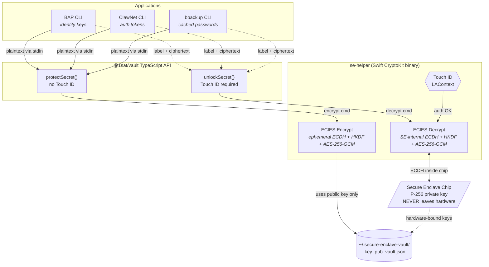

# @1sat/vault

Secure Enclave hardware vault for protecting secrets with Touch ID on macOS Apple Silicon.

P-256 keys are generated **inside the Secure Enclave chip** and never leave it. Encryption uses
ECIES (ECDH-P256 + HKDF-SHA256 + AES-256-GCM) with the public key only — no Touch ID needed to
protect a secret. Decryption triggers Touch ID and performs ECDH inside the chip.

**Platform**: macOS arm64 only (Apple Silicon with Secure Enclave).

---

## Table of Contents

- [Security Model](#security-model)
- [Installation](#installation)
- [Quick Start](#quick-start)
- [API Reference](#api-reference)
  - [High-Level Vault](#high-level-vault)
  - [Low-Level Enclave](#low-level-enclave)
  - [Platform](#platform)
  - [Types](#types)
- [Usage Examples](#usage-examples)
- [Label Format](#label-format)
- [Architecture](#architecture)
- [Headless / CI Environments](#headless--ci-environments)
- [Environment Variables](#environment-variables)
- [Non-Portability Warning](#non-portability-warning)
- [License](#license)

---

## Security Model

- **Private key never leaves hardware.** The P-256 private key is generated inside and remains
  inside the Secure Enclave chip. Even the operating system cannot read it.
- **Key persistence is hardware-bound.** CryptoKit `dataRepresentation` files at
  `~/.secure-enclave-vault/<label>.key` are opaque blobs that are useless on any other machine.
- **Encryption requires no biometrics.** `protectSecret` uses only the public key; Touch ID is
  not prompted.
- **Decryption requires Touch ID.** `unlockSecret` triggers LAContext biometric authentication;
  ECDH happens inside the chip.
- **No entitlements or signing needed.** No `keychain-access-groups`, no `.app` bundle, no
  provisioning profile, no code signing. Works from bare CLI binaries.
- **Secrets never appear in process args.** Plaintext is passed to the Swift helper via stdin,
  not command-line arguments.

---

## Installation

```bash
bun add @1sat/vault
```

`postinstall` automatically compiles the Swift CryptoKit binary using `swiftc`. If Xcode Command
Line Tools are not installed, the build step will fail with a clear message.

```bash
# Install Xcode Command Line Tools if you see a swiftc error:
xcode-select --install
```

If the binary is missing at runtime (e.g., bun used a cached install that skipped `postinstall`),
the package will attempt to recompile it on first use.

---

## Quick Start

```typescript
import { protectSecret, unlockSecret, isSupported } from '@1sat/vault'

if (!isSupported()) {
  console.error('@1sat/vault: Secure Enclave requires macOS arm64')
  process.exit(1)
}

// Encrypt — no Touch ID prompt
await protectSecret('my-api-key', 'sk_live_abc123', { service: 'stripe' })

// Decrypt — triggers Touch ID
const { plaintext, metadata } = await unlockSecret('my-api-key')
console.log(plaintext) // sk_live_abc123
console.log(metadata)  // { service: 'stripe' }
```

---

## API Reference

### High-Level Vault

These functions are the primary interface. They manage key generation, encryption, and disk
storage automatically.

---

#### `protectSecret(label, plaintext, metadata?)`

Generates a P-256 key in the Secure Enclave, encrypts `plaintext` with ECIES, and writes the
encrypted entry to disk. **Does not require Touch ID.**

```typescript
function protectSecret(
  label: string,
  plaintext: string,
  metadata?: Record<string, string>
): Promise<ProtectResult>
```

| Parameter  | Type                      | Description                                   |
|------------|---------------------------|-----------------------------------------------|
| `label`    | `string`                  | Unique identifier for this secret (see [Label Format](#label-format)) |
| `plaintext`| `string`                  | The secret value to protect                   |
| `metadata` | `Record<string, string>`  | Optional key-value pairs stored alongside the ciphertext |

**Returns** `ProtectResult` — contains the public key hex string.

Calling `protectSecret` for an existing label overwrites the key and ciphertext.

---

#### `unlockSecret(label)`

Reads the vault entry from disk and decrypts the ciphertext using the Secure Enclave private key.
**Triggers a Touch ID prompt.**

```typescript
function unlockSecret(label: string): Promise<UnlockResult>
```

| Parameter | Type     | Description                      |
|-----------|----------|----------------------------------|
| `label`   | `string` | The label used in `protectSecret` |

**Returns** `UnlockResult` — contains `plaintext` and the stored `metadata`.

**Throws** if Touch ID fails, is cancelled, or the label has no vault entry.

---

#### `removeSecret(label)`

Deletes both the Secure Enclave key files and the vault entry from disk.

```typescript
function removeSecret(label: string): Promise<void>
```

---

#### `listSecrets()`

Returns metadata for all vault entries. **Does not require Touch ID.** Does not expose any
ciphertext or key material.

```typescript
function listSecrets(): VaultSummary[]
```

**Returns** an array of `VaultSummary` objects, one per vault entry.

---

### Low-Level Enclave

These functions map directly to the Swift `se-helper` binary subcommands. Use them when you need
fine-grained control over key lifecycle or want to encrypt data without writing vault metadata.

---

#### `checkAvailability()`

Checks whether the Secure Enclave and biometric authentication are available.

```typescript
function checkAvailability(): Promise<SEAvailability>
```

---

#### `generateKey(label)`

Generates a P-256 key pair inside the Secure Enclave and saves the opaque key representation to
disk. Returns the public key hex and the path of the key file.

```typescript
function generateKey(label: string): Promise<{ publicKey: string; keyFile: string }>
```

---

#### `encrypt(label, plaintext)`

Encrypts `plaintext` with ECIES using the public key for `label`. **No Touch ID.**

```typescript
function encrypt(label: string, plaintext: string): Promise<string>
```

**Returns** base64-encoded ciphertext.

---

#### `decrypt(label, ciphertext)`

Decrypts `ciphertext` using the Secure Enclave private key for `label`. **Triggers Touch ID.**

```typescript
function decrypt(label: string, ciphertext: string): Promise<string>
```

---

#### `deleteKey(label)`

Deletes the Secure Enclave key files for `label`.

```typescript
function deleteKey(label: string): Promise<void>
```

---

#### `listKeys()`

Lists all SE keys managed by this vault, returning label and public key pairs.

```typescript
function listKeys(): Promise<Array<{ label: string; publicKey: string }>>
```

---

### Platform

#### `isSupported()`

Returns `true` if the current process is running on macOS arm64. Safe to call anywhere; never
throws.

```typescript
function isSupported(): boolean
```

Use this for a quick guard before calling any vault operations.

#### `assertSupported()`

Throws an `Error` with a descriptive message if the current platform is not macOS arm64. Called
internally by all enclave operations.

```typescript
function assertSupported(): void
```

---

### Types

```typescript
interface ProtectResult {
  publicKey: string          // Hex-encoded compressed P-256 public key
}

interface UnlockResult {
  plaintext: string
  metadata?: Record<string, string>
}

interface VaultSummary {
  label: string
  metadata?: Record<string, string>
  createdAt: string          // ISO 8601 timestamp
}

interface SEAvailability {
  secureEnclave: boolean
  biometryType: string       // 'TouchID' | 'FaceID' | 'None'
  biometryAvailable: boolean
  vaultDir: string           // Resolved vault directory path
}

interface VaultEntry {       // On-disk format, not typically used directly
  ciphertext: string
  metadata?: Record<string, string>
  publicKey: string
  createdAt: string
}
```

---

## Usage Examples

### Protect and unlock a secret

```typescript
import { protectSecret, unlockSecret, isSupported } from '@1sat/vault'

if (!isSupported()) {
  console.error('@1sat/vault: requires macOS arm64')
  process.exit(1)
}

// Store — no biometric prompt
const { publicKey } = await protectSecret('stripe-key', 'sk_live_abc123', {
  service: 'stripe',
  env: 'production',
})
console.log('Protected with public key:', publicKey)

// Retrieve — Touch ID dialog appears
const { plaintext, metadata } = await unlockSecret('stripe-key')
console.log(plaintext)  // sk_live_abc123
console.log(metadata)   // { service: 'stripe', env: 'production' }
```

### Check platform availability

```typescript
import { checkAvailability } from '@1sat/vault'

const status = await checkAvailability()
console.log(status)
// {
//   secureEnclave: true,
//   biometryType: 'TouchID',
//   biometryAvailable: true,
//   vaultDir: '/Users/you/.secure-enclave-vault'
// }
```

### List stored secrets

```typescript
import { listSecrets } from '@1sat/vault'

const secrets = listSecrets()
for (const s of secrets) {
  console.log(s.label, s.createdAt, s.metadata)
}
```

### Remove a secret

```typescript
import { removeSecret } from '@1sat/vault'

await removeSecret('stripe-key')
// Key and vault entry deleted from disk
```

### Error handling

```typescript
import { unlockSecret } from '@1sat/vault'

try {
  const { plaintext } = await unlockSecret('my-secret')
} catch (err) {
  const msg = (err as Error).message
  if (msg.includes('BIOMETRY_FAILED') || msg.includes('User canceled')) {
    console.error('Touch ID was cancelled or failed')
  } else if (msg.includes('No vault entry')) {
    console.error('No vault entry exists for this label')
  } else if (msg.includes('requires macOS')) {
    console.error('Platform not supported')
  } else {
    throw err
  }
}
```

---

## Label Format

Labels must match the pattern `^[a-zA-Z0-9][a-zA-Z0-9._-]{0,62}$`:

- 1 to 63 characters total
- Must start with an alphanumeric character
- Subsequent characters may be alphanumeric, `.`, `_`, or `-`
- No path separators or spaces

```typescript
// Valid
'stripe-key'
'db.password'
'api_token_prod'

// Invalid — throws immediately
'../escape'
'has spaces'
'.starts-with-dot'
```

Labels map directly to filenames under the vault directory. Invalid labels are rejected before
any file or SE operation.

---

## Architecture

```
@1sat/vault
  src/
    index.ts        — re-exports everything
    platform.ts     — isSupported(), assertSupported()
    enclave.ts      — low-level SE operations via child process
    vault.ts        — high-level protectSecret/unlockSecret/etc
    types.ts        — shared TypeScript interfaces
  swift/
    Sources/main.swift   — CryptoKit SE helper (compiled to se-helper)
    build.sh             — swiftc compilation script (runs on postinstall)
    se-helper            — compiled binary (not in source control)
```

**Runtime flow:**



1. TypeScript calls `Bun.spawn(['swift/se-helper', subcommand, label, ...])`.
2. `se-helper` uses `CryptoKit.SecureEnclave.P256` and `LocalAuthentication.LAContext`.
3. Key files are stored at `~/.secure-enclave-vault/<label>.key` (opaque hardware-bound blob)
   and `<label>.pub` (raw public key).
4. Vault metadata is stored at `~/.secure-enclave-vault/<label>.vault.json` (mode 0600).
5. The vault directory itself is created with mode 0700.
6. Plaintext input to the `encrypt` subcommand is passed via stdin, not CLI args, so it does not
   appear in process listings.

The Swift binary is compiled without code signing or entitlements. CryptoKit's Secure Enclave
API does not require them when accessed from a CLI binary on macOS.

---

## Headless / CI Environments

`isSupported()` returns `false` on any platform that is not macOS arm64. The `build.sh` script
exits 0 on non-macOS so `bun install` succeeds in Linux CI pipelines.

This package does **not** provide a software fallback. If you call any vault function on an
unsupported platform, `assertSupported()` throws immediately with a descriptive message.
Consumers are responsible for implementing their own strategy for headless environments (for
example, reading from environment variables or a separate secrets manager).

---

## Environment Variables

| Variable       | Default                        | Description                                    |
|----------------|--------------------------------|------------------------------------------------|
| `SE_VAULT_DIR` | `~/.secure-enclave-vault`      | Override the directory used to store vault files |

---

## Non-Portability Warning

> **Vault entries are permanently bound to your specific Secure Enclave chip.**
>
> The encrypted key files at `~/.secure-enclave-vault/` are hardware-bound. They cannot be
> copied to another machine and decrypted there. Moving to new hardware, wiping macOS, or
> restoring from a Time Machine backup to a different Mac **permanently destroys all vault
> entries**.
>
> Always export or back up secrets that are protected by the vault **before**:
> - Wiping or reinstalling macOS
> - Moving to new hardware
> - Encrypting secrets for the first time in production
>
> The vault is a security layer, not a backup mechanism.

---

## License

MIT
